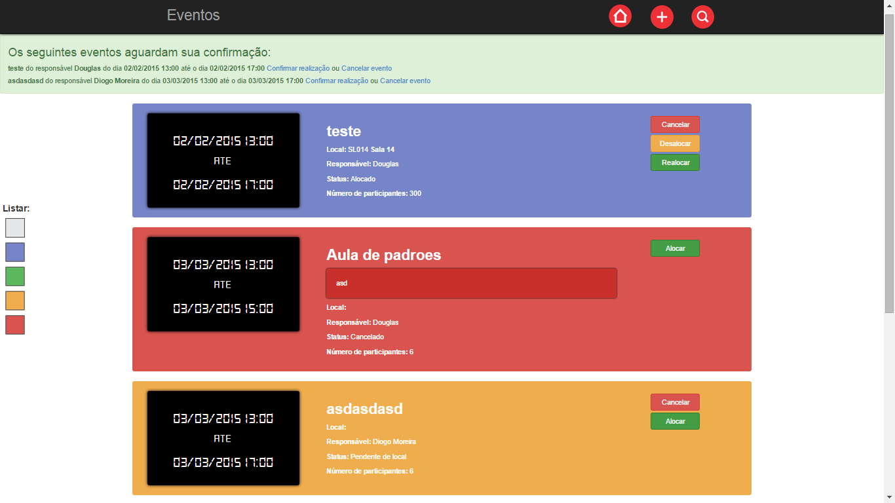

<link href="../css/projetos.css" rel="stylesheet" type="css/text">

	<h1>Alocador de salas</h1> 
	
	
Este sistema foi proposto como projeto final da disciplina de Padrões de Projetos do curso de ADS, no 4º período. A descrição detalhada do mesmo pode ser encontrada <a href="https://drive.google.com/file/d/0B4ecCshjvEmeb1kzb0hMejM0NEU/view">aqui</a>. Em resumo, o sistema deve tornar possível o cadastro de várias salas, e posteriormente deve ser possível buscar, editar informações e excluir as salas cadastradas. Além disto, o sistema deve permitir o cadastro de eventos, e a alocação de tais eventos em salas que estejam disponíveis no momento da sua realização, e que possuam capacidade para a quantidade de participantes especificada. Também deve ser possível operações como: cancelar, confirmar realização, realocar e desalocar eventos.
 
	
O sistema foi desenvolvido em Java, para plataforma Web, utilizando tecnologias como: HTML, CSS, Javascript, Bootstrap, Sevlets, JSP, JSTL, JDBC.
 
	<a class="btn btn-default" href="https://github.com/douglasgabriel/ControleDeSalas">Repositório</a>
	<a class="btn btn-default" href="../documentacao/alocadordesalas/">Documentação</a>

